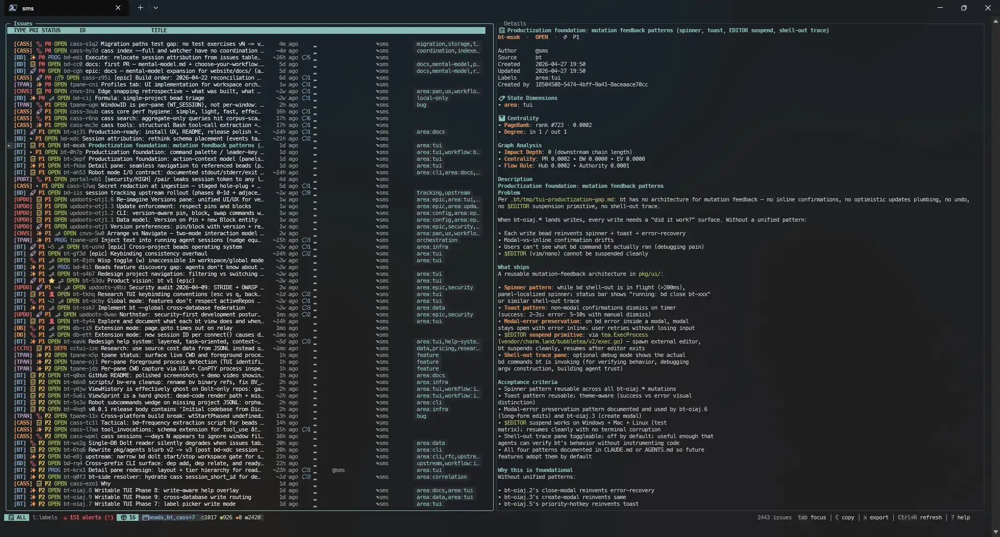
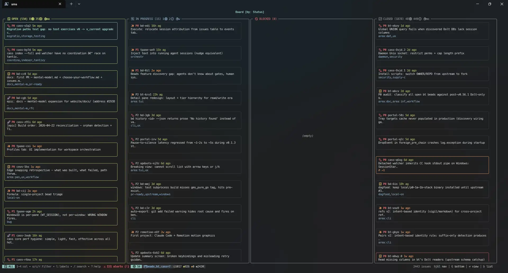
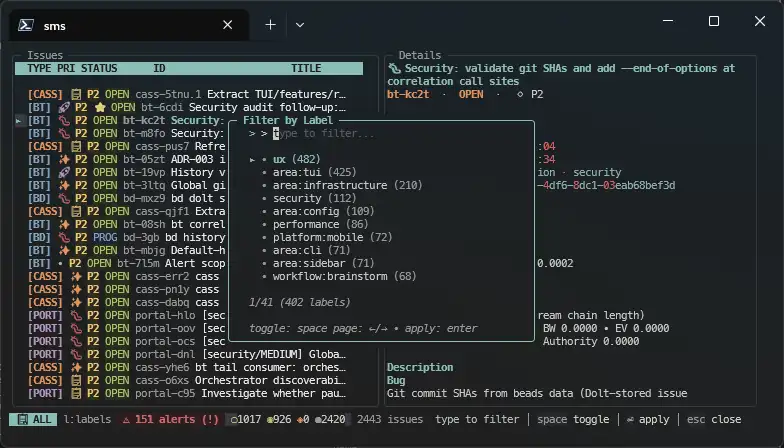
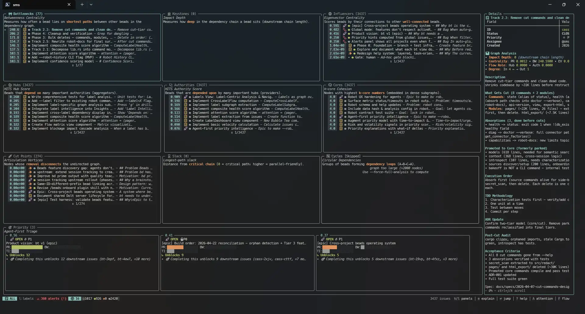

# bt

A terminal UI for [beads](https://github.com/gastownhall/beads) - keyboard-driven issue tracking in your terminal.



> **Alpha.** v0.1.0 is the first public cut. Active development; APIs, keybindings, and on-disk formats may change before v1.0.

## What is bt

[Beads](https://github.com/gastownhall/beads) is a git-native issue tracker backed by [Dolt](https://www.dolthub.com/) (a version-controlled MySQL-compatible database). `bt` is a TUI that sits on top of it - board views, detail panels, dependency graphs, and graph-based triage, all without leaving your terminal.

Think lazygit, but for issue tracking.

This started as a fork of Jeffrey Emanuel's [beads_viewer](https://github.com/Dicklesworthstone/beads_viewer), retargeted at upstream beads and its Dolt backend. The Dolt integration, theme system, BQL, cross-platform test suite, and ongoing UI work is the fork.

## Install

Requires a working [beads](https://github.com/gastownhall/beads) installation with Dolt. For the full first-time setup walkthrough — prerequisites, init flow, common failures — see [`docs/install.md`](docs/install.md). The short version is below.

### Pre-built binaries (no Go toolchain needed)

Download the binary for your platform from the [latest release](https://github.com/seanmartinsmith/beadstui/releases/latest). Available for macOS, Linux, and Windows on both amd64 and arm64. Verify with the included `checksums.txt`, extract the archive, and place `bt` somewhere on your `PATH`.

### From source (requires Go 1.25+)

```bash
go install github.com/seanmartinsmith/beadstui/cmd/bt@latest
```

Or build from a clone:

```bash
git clone https://github.com/seanmartinsmith/beadstui.git
cd beadstui
go build ./cmd/bt/
```

## Quick start

```bash
cd your-project    # any directory with beads initialized
bt                 # launches the TUI
```

`bt` auto-starts a Dolt server if one isn't running, connects over MySQL protocol, and polls for changes. When you exit, it shuts down the server if it started one.

## Views

| Key | View | What it shows |
|-----|------|---------------|
| `l` | **List** | Issue list with detail panel (default) |
| `b` | **Board** | Kanban columns by status |
| `i` | **Insights** | PageRank, critical path, cycle detection |



## Features

**Board and detail views** - Navigate issues with vim-style keys. Expand any issue to see full markdown-rendered detail (via Glamour). Board view shows kanban columns grouped by status.

**Filter and search** - Filter by label, status, priority, type, or assignee with modal pickers. Fuzzy-search across the full label taxonomy.



**Graph-based triage** - PageRank, betweenness centrality, HITS, eigenvector, and k-core metrics computed over the issue dependency graph. Cycle detection, critical path analysis, and articulation point identification. Surfaces what actually matters, not just what's loudest.



**BQL (Beads Query Language)** - Composable search and filter from inside the TUI. Press `:` to open the query bar. The parser is adapted from [Perles](https://github.com/zjrosen/perles), MIT-licensed; see [`pkg/bql/LICENSE`](pkg/bql/LICENSE).

```
status = open AND priority <= P2
assignee = "sms" AND updated_at > -7d
type = bug OR label ~ "backend"
```

Supports `=`, `!=`, `<`, `>`, `~` (regex), `IN`, `NOT IN`, `AND`/`OR`/`NOT`, parentheses, relative dates (`-7d`, `-3m`, `today`), `ORDER BY`, and `EXPAND` for dependency traversal.

**Dolt lifecycle management** - Auto-starts and stops the Dolt server. Freshness monitoring with configurable stale thresholds. Auto-reconnect on connection loss.

**Theme system** - Ships with Tomorrow Night (dark) and Tomorrow Day (light). Fully customizable via YAML - user-level (`~/.config/bt/theme.yaml`) or project-level (`.bt/theme.yaml`).

**Robot mode** - Machine-readable JSON output via `bt robot <subcmd>` for AI agent integration. Triage recommendations, execution plans, priority analysis, graph metrics - all as structured JSON to stdout. See [AGENTS.md](AGENTS.md) for the full API.

## Key bindings

| Key | Action |
|-----|--------|
| `j`/`k` or arrows | Navigate |
| `Enter` | Expand/collapse detail |
| `b` | Board view |
| `i` | Insights |
| `l` | List view |
| `/` | Search |
| `:` | BQL query |
| `f` | Filter by status |
| `p` | Filter by priority |
| `t` | Filter by type |
| `?` | Help |
| `q` | Quit |

## Configuration

Config is loaded in layers (later overrides earlier):

1. Built-in defaults
2. `~/.config/bt/theme.yaml` - user-level theme
3. `.bt/theme.yaml` - project-level theme

### Dolt connection

| Variable | Default | Description |
|----------|---------|-------------|
| `BEADS_DOLT_SERVER_PORT` | - | Port override (highest priority) |
| `BT_DOLT_PORT` | - | Port override |
| `BT_DOLT_POLL_INTERVAL_S` | `5` | Poll interval in seconds |
| `BT_FRESHNESS_STALE_S` | `120` | Seconds before data shows stale |
| `BT_FRESHNESS_WARN_S` | `30` | Seconds before stale warning |

## Robot mode

The `bt robot <subcmd>` family emits deterministic JSON to stdout. This is how AI agents interact with bt - no TUI, just structured data.

```bash
bt robot triage          # ranked recommendations, quick wins, blockers
bt robot next            # single top pick with claim command
bt robot plan            # parallel execution tracks
bt robot insights        # full graph metrics
bt robot alerts          # stale issues, blocking cascades
```

Run `bt robot --help` for the full subcommand list (~30+ subcmds including nested groups: `bt robot files`, `bt robot correlation`, `bt robot labels`).

See [AGENTS.md](AGENTS.md) for the quick-reference table. Full API reference - output shapes, flags, examples - at [`docs/robot/README.md`](docs/robot/README.md).

## Built with

- [Bubble Tea](https://github.com/charmbracelet/bubbletea) - TUI framework (Elm architecture)
- [Lip Gloss](https://github.com/charmbracelet/lipgloss) - Terminal styling
- [Glamour](https://github.com/charmbracelet/glamour) - Markdown rendering
- [Bubbles](https://github.com/charmbracelet/bubbles) - Reusable TUI components
- [Dolt](https://www.dolthub.com/) - Version-controlled database backend

## Contributing

PRs welcome - including AI-assisted ones. See [`CONTRIBUTING.md`](CONTRIBUTING.md) for the maintainer posture, hygiene rules, and PR decision tree.

If you're new here, start with these:

- [`CONTRIBUTING.md`](CONTRIBUTING.md) - PR workflow, hygiene rules, decision tree
- [`AGENTS.md`](AGENTS.md) - project conventions, commit format, issue-tracking workflow
- [`docs/design/testing.md`](docs/design/testing.md) - test patterns, fixtures, coverage thresholds
- [`docs/adr/`](docs/adr/) - architecture decisions ([index](docs/adr/README.md))

```bash
go build ./cmd/bt/     # build
go test ./...          # run all tests
go vet ./...           # static analysis
```

The codebase is cross-platform (Windows + Unix) with ~92k lines of production Go and ~102k lines of tests across 27 packages.

## License

MIT License with OpenAI/Anthropic Rider. See [LICENSE](LICENSE).

Copyright (c) 2026 Jeffrey Emanuel
Copyright (c) 2026 Sean Martin Smith

## Acknowledgments

- [Jeffrey Emanuel](https://github.com/Dicklesworthstone) for building beads_viewer - the TUI architecture and graph algorithms this project is built on
- [Steve Yegge](https://github.com/steveyegge) for beads
- [Perles](https://github.com/zjrosen/perles) by Zach Rosen, the source for bt's adapted BQL parser (`pkg/bql/`, MIT)
- [Charm](https://charm.sh) for the terminal UI ecosystem
