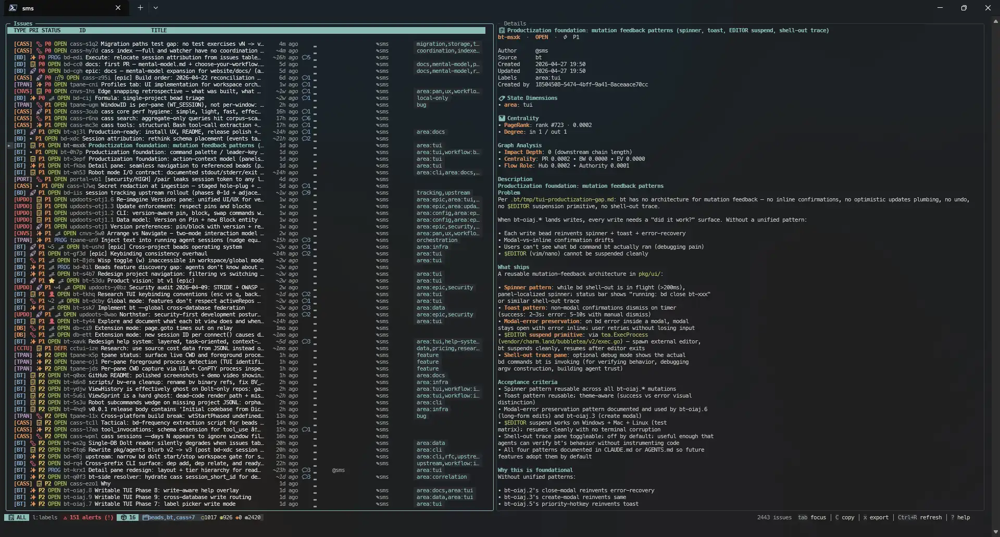
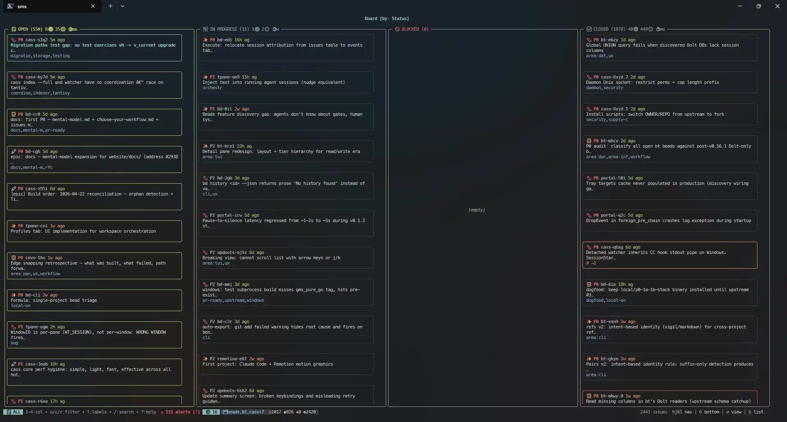
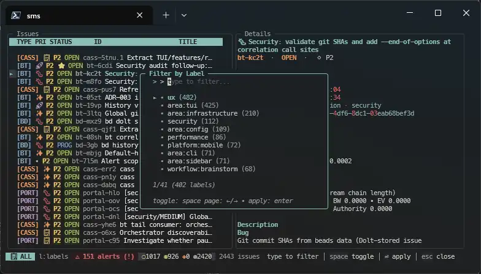
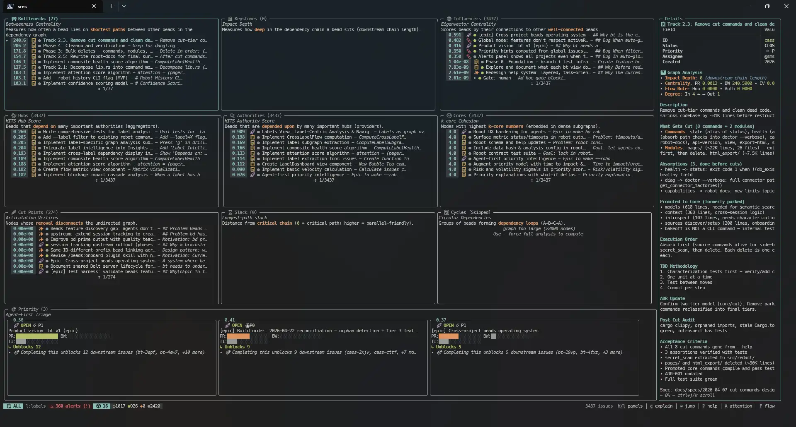

# bt

A terminal UI for [beads](https://github.com/gastownhall/beads) - keyboard-driven issue tracking in your terminal.



> **Alpha.** v0.1.0 is the first public cut. Active development; APIs, keybindings, and on-disk formats may change before v1.0.

## What is bt

[Beads](https://github.com/gastownhall/beads) is a git-native issue tracker backed by [Dolt](https://www.dolthub.com/) (a version-controlled MySQL-compatible database). `bt` is a TUI that sits on top of it - board views, detail panels, dependency graphs, and graph-based triage, all without leaving your terminal.

Think lazygit, but for issue tracking.

## Install

Requires a working [beads](https://github.com/gastownhall/beads) installation with Dolt. For the full first-time setup walkthrough — prerequisites, init flow, common failures — see [`docs/install.md`](docs/install.md). The short version is below.

### Pre-built binaries (no Go toolchain needed)

Download the binary for your platform from the [latest release](https://github.com/seanmartinsmith/beadstui/releases/latest). Available for macOS, Linux, and Windows on both amd64 and arm64. Verify with the included `checksums.txt`, extract the archive, and place `bt` somewhere on your `PATH`.

### From source (requires Go 1.25+)

```bash
go install github.com/seanmartinsmith/beadstui/cmd/bt@latest
```

Or build from a clone:

```bash
git clone https://github.com/seanmartinsmith/beadstui.git
cd beadstui
go build ./cmd/bt/
```

## Shared-server mode (for the cross-project view)

For single-project use you need nothing special: `cd` into any beads project and run `bt`. A project in bd's default embedded mode is read directly via `bd export` (into memory, never persisted) - no server and no lock, so a concurrent `bd` command is never blocked. If the project runs on a shared Dolt server bt connects to that; a project configured for server mode with none running gets a per-session server (via `bd dolt start`) that bt stops on exit.

The cross-project global view is what needs shared-server mode. It enumerates projects from the `beads_global` aggregate database on a single shared Dolt server at `~/.beads/shared-server/`. Projects in bd's default embedded mode keep their data in the project's own `.beads/embeddeddolt/` directory, so it never touches the shared server - those projects work fine on their own but won't appear in the global view.

**To make a project visible in the cross-project view, enable shared-server mode.**

For a new project:

```bash
bd init --shared-server
```

For an existing project already initialized in embedded mode:

```bash
bd config set dolt.shared-server true
```

After switching, run `bd dolt start` once to migrate the project onto the shared server. See [bd's docs/DOLT.md - Shared-Server Mode](https://github.com/gastownhall/beads/blob/main/docs/DOLT.md#shared-server-mode) for the full migration walkthrough and background on the two modes.

> **Note:** If you launch the cross-project view and some of your beads projects are missing, this is the most likely cause. The global view shows only projects whose databases are registered on the shared server.

## Quick start

```bash
cd your-project    # any directory with beads initialized
bt                 # launches the TUI
```

How bt reads your project depends on your bd setup:

| Your bd setup | What bt does |
|---|---|
| Default (embedded - bd spawns a Dolt per command) | bt reads the project via `bd export` into memory - no server, no lock, coexists with a concurrent `bd`. |
| You ran `bd dolt start` (one shared server, N project DBs) | bt auto-discovers it via the port file and connects - no new server. |
| You want a cross-project view | `bt --global` queries the `beads_global` aggregate database on the shared server. |

**Embedded mode + concurrent `bd`:** because bt reads embedded projects through `bd export` and holds no server or lock, running `bd` from another shell during a bt session is safe - bt picks up the change on its next refresh. Remaining mode-parity edge cases are tracked in bt-gm6ur.

### Mode parity

Embedded mode (bd's default since v1.0) supports the full core surface - list/detail, board, triage, graph analysis, BQL, search, and every `bt robot` subcommand. A few capabilities differ by backend:

| Capability | Embedded / project (default) | Shared-server / `--global` |
|---|---|---|
| Live refresh | Event-driven - watches the Dolt manifest, re-runs `bd export` on change | SQL polling |
| Startup | Instant (in-process load), no splash | Brief loading indicator during the remote fetch |
| Notifications / alerts | Scoped to the current project | Scoped to the selection (all projects in the global view) |
| History / correlation | Not available yet - explicit banner, never silent (bt-5uaxh) | Available |
| Cross-project view | Single project by nature | Aggregates every project on the shared server |

Two notes:

- **Embedded is single-project by nature.** Its data lives in the project's own `.beads/embeddeddolt/`, so it won't appear in the cross-project `--global` view until you [switch it to shared-server mode](#shared-server-mode-for-the-cross-project-view).
- **Point-in-time (`--as-of`)** is an interactive-TUI feature (`bt --as-of <ref>`); it is not yet supported in robot mode, where it refuses explicitly rather than return current data as historical (tracked in bt-9kiy4).

## Views

| Key | View | What it shows |
|-----|------|---------------|
| `l` | **List** | Issue list with detail panel (default) |
| `b` | **Board** | Kanban columns by status |
| `i` | **Insights** | PageRank, critical path, cycle detection |



## Features

**Board and detail views** - Navigate issues with vim-style keys. Expand any issue to see full markdown-rendered detail (via Glamour). Board view shows kanban columns grouped by status.

**Filter and search** - Filter by label, status, priority, type, or assignee with modal pickers. Fuzzy-search across the full label taxonomy.



**Graph-based triage** - PageRank, betweenness centrality, HITS, eigenvector, and k-core metrics computed over the issue dependency graph. Cycle detection, critical path analysis, and articulation point identification. Surfaces what actually matters, not just what's loudest.



**BQL (Beads Query Language)** - Composable search and filter from inside the TUI. Press `:` to open the query bar. The parser is adapted from [Perles](https://github.com/zjrosen/perles), MIT-licensed; see [`pkg/bql/LICENSE`](pkg/bql/LICENSE).

```
status = open and priority <= P2
assignee = "sms" and updated_at > -7d
type = bug or label ~ backend
```

Supports `=`, `!=`, `<`, `>`, `~` (substring), `in`, `not in`, `and`/`or`/`not`, parentheses, relative dates (`-7d`, `-3m`, `today`), `order by`, and `expand` for dependency traversal. Full reference: [`docs/bql.md`](docs/bql.md).

**Dolt lifecycle management** - Auto-starts and stops a per-session Dolt server when no shared server is reachable; defers to `bd dolt start` when one is running. Freshness monitoring with configurable stale thresholds. Auto-reconnect on connection loss.

**Theme system** - Ships with Tomorrow Night (dark) and Tomorrow Day (light). Fully customizable via YAML - user-level (`~/.config/bt/theme.yaml`) or project-level (`.bt/theme.yaml`).

**Robot mode** - Machine-readable JSON output via `bt robot <subcmd>` for AI agent integration. Triage recommendations, execution plans, priority analysis, graph metrics - all as structured JSON to stdout. See [docs/robot/README.md](docs/robot/README.md) for the full API.

## Key bindings

| Key | Action |
|-----|--------|
| `j`/`k` or arrows | Navigate |
| `Enter` | Expand/collapse detail |
| `b` | Board view |
| `i` | Insights |
| `l` | List view |
| `/` | Search |
| `:` | BQL query |
| `f` | Filter by status |
| `p` | Filter by priority |
| `t` | Filter by type |
| `?` | Help |
| `q` | Quit |

## Configuration

Config is loaded in layers (later overrides earlier):

1. Built-in defaults
2. `~/.config/bt/theme.yaml` - user-level theme
3. `.bt/theme.yaml` - project-level theme

### Environment variables

The most common knobs are the Dolt-connection and freshness vars below. For the full reference — every `BT_*`, the relevant `BEADS_*`, and the bd-side `BD_ACTOR`/`BEADS_ACTOR` — see [`docs/env-vars.md`](docs/env-vars.md).

| Variable | Default | Description |
|----------|---------|-------------|
| `BEADS_DOLT_SERVER_PORT` | - | Dolt port (highest priority) |
| `BT_DOLT_PORT` | - | Dolt port (bt-specific override) |
| `BT_DOLT_POLL_INTERVAL_S` | `5` | Poll interval in seconds |
| `BT_FRESHNESS_STALE_S` | `120` | Seconds before data shows stale |
| `BT_FRESHNESS_WARN_S` | `30` | Seconds before stale warning |

## Robot mode

The `bt robot <subcmd>` family emits deterministic JSON to stdout. This is how AI agents interact with bt - no TUI, just structured data.

```bash
bt robot triage          # ranked recommendations, quick wins, blockers
bt robot next            # single top pick with claim command
bt robot plan            # parallel execution tracks
bt robot insights        # full graph metrics
bt robot alerts          # stale issues, blocking cascades
```

Run `bt robot --help` for the full subcommand list (~30+ subcmds including nested groups: `bt robot files`, `bt robot correlation`, `bt robot labels`).

See [AGENTS.md](AGENTS.md) for the quick-reference table. Full API reference - output shapes, flags, examples - at [`docs/robot/README.md`](docs/robot/README.md).

## Built with

- [Bubble Tea](https://github.com/charmbracelet/bubbletea) - TUI framework (Elm architecture)
- [Lip Gloss](https://github.com/charmbracelet/lipgloss) - Terminal styling
- [Glamour](https://github.com/charmbracelet/glamour) - Markdown rendering
- [Bubbles](https://github.com/charmbracelet/bubbles) - Reusable TUI components
- [Dolt](https://www.dolthub.com/) - Version-controlled database backend

## Contributing

PRs welcome - including AI-assisted ones. See [`CONTRIBUTING.md`](CONTRIBUTING.md) for the maintainer posture, hygiene rules, and PR decision tree.

If you're new here, start with these:

- [`CONTRIBUTING.md`](CONTRIBUTING.md) - PR workflow, hygiene rules, decision tree
- [`AGENTS.md`](AGENTS.md) - project conventions, commit format, issue-tracking workflow
- [`docs/design/testing.md`](docs/design/testing.md) - test patterns, fixtures, coverage thresholds
- [`docs/adr/`](docs/adr/) - architecture decisions ([index](docs/adr/README.md))

```bash
go build ./cmd/bt/     # build
go test ./...          # run all tests
go vet ./...           # static analysis
```

The codebase is cross-platform (Windows + Unix) with ~92k lines of production Go and ~102k lines of tests across 27 packages.

## License

MIT License with OpenAI/Anthropic Rider. See [LICENSE](LICENSE).

Copyright (c) 2026 Jeffrey Emanuel
Copyright (c) 2026 Sean Martin Smith

## Acknowledgments

- [Jeffrey Emanuel](https://github.com/Dicklesworthstone) for building beads_viewer - the TUI architecture and graph algorithms this project is built on
- [Steve Yegge](https://github.com/steveyegge) for beads
- [Perles](https://github.com/zjrosen/perles) by Zach Rosen, the source for bt's adapted BQL parser (`pkg/bql/`, MIT)
- [Charm](https://charm.sh) for the terminal UI ecosystem
